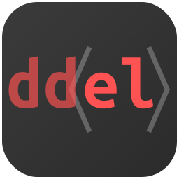

**Alpha**
| [Docs](https://jaandrle.github.io/deka-dom-el "Official documentation and guide site")
| [NPM](https://www.npmjs.com/package/deka-dom-el "Official NPM package page")
| [GitHub](https://github.com/jaandrle/deka-dom-el "Official GitHub repository")
([*Gitea*](https://gitea.jaandrle.cz/jaandrle/deka-dom-el "GitHub repository mirror on my own Gitea instance"))

***Vanilla for flavouring — a full-fledged feast for large projects***

```javascript
// 🌟 Reactive component with clear separation of concerns
document.body.append(
	el(EmojiCounter, { initial: "🚀" })
);

function EmojiCounter({ initial }) {
	// ✨ - Define reactive data
	const count = S(0);
	const emoji = S(initial);
	const textContent = S(() => `Hello World ${emoji.get().repeat(count.get())}`);

	// 🔄 - UI updates automatically when signals change
	return el().append(
		el("p", { textContent, className: "output" }),

		// 🎮 - Update state on events
		el("button", { textContent: "Add Emoji" },
			on("click", () => count.set(count.get() + 1)),
		),

		el("select", null,
			on.defer(el=> el.value= initial),
			on("change", e => emoji.set(e.target.value)),
		).append(
			el(Option, "🎉"),
			el(Option, "🚀"),
			el(Option, "💖"),
		)
	);
}
function Option({ textContent }){
	return el("option", { value: textContent, textContent });
}
```
*…use simple DOM API by default and library tools and logic when you need them*

# Deka DOM Elements (dd\<el\> or DDE)

Creating reactive elements, components, and Web Components using the native
[IDL](https://developer.mozilla.org/en-US/docs/Glossary/IDL)/JavaScript DOM API enhanced with
[**signals/observables**](#understanding-signals).

## Features at a Glance

- ✅ **No build step required** — use directly in browsers or Node.js
- ☑️ **Lightweight** — ~10-15kB minified (original goal 10kB) with **zero**/minimal dependencies
- ✅ **Declarative & functional approach** for clean, maintainable code
- ✅ **Signals and events** for reactive UI
- ✅ **Auto-releasing resources** for memory management but nice development experience
- ✅ **Memoization for performance** — optimize rendering with intelligent caching
- ☑️ **Optional build-in signals** with support for custom reactive implementations (#39)
- ☑️ **Server-side rendering** support via [jsdom](https://github.com/jsdom/jsdom)
- ✅ **TypeScript support**
- ✅ **Support for debugging with browser DevTools** without extensions
- ☑️ **Enhanced Web Components** support

## Getting Started

### Documentation

- [**Documentation and Guide**](https://jaandrle.github.io/deka-dom-el)
- [**Examples**](https://jaandrle.github.io/deka-dom-el/p15-examples.html)

### Installation

```bash
npm install deka-dom-el --save
```

…or via CDN / Direct Script:

For CDN links and various build formats (ESM/IIFE, with/without signals, minified/unminified), see the [interactive
format selector](https://jaandrle.github.io/deka-dom-el/#h-getting-started) on the documentation site.

```html
<!-- Example with IIFE build (creates a global DDE object) -->
<script src="https://cdn.jsdelivr.net/gh/jaandrle/deka-dom-el/dist/iife-with-signals.min.js"></script>
<script>
	const { el, S } = DDE;
	// Your code here
</script>

<!-- Or with ES modules -->
<script type="module">
	import { el, S } from "https://cdn.jsdelivr.net/gh/jaandrle/deka-dom-el/dist/esm-with-signals.min.js";
	// Your code here
</script>
```

## Why Another Library?

This library bridges the gap between minimal solutions like van/hyperscript and more comprehensive frameworks like
[solid-js](https://github.com/solidjs/solid), offering a balanced trade-off between size, complexity, and usability.

Following functional programming principles, dd\<el\> starts with pure JavaScript (DOM API) and gradually adds
auxiliary functions. These range from minor improvements to advanced features for building complete declarative
reactive UI templates.

A key advantage: any internal function (`assign`, `classListDeclarative`, `on`, `dispatchEvent`, `S`, etc.) can be used
independently while also working seamlessly together. This modular approach makes it easier to integrate the library
into existing projects.

## Understanding Signals

Signals are the reactive backbone of Deka DOM Elements:

- [Signals — what's going on behind the scenes](https://itnext.io/signals-whats-going-on-behind-the-scenes-ec858589ea63)
- [The Evolution of Signals in JavaScript](https://dev.to/this-is-learning/the-evolution-of-signals-in-javascript-8ob)
- [TC39 Signals Proposal](https://github.com/tc39/proposal-signals) (future standard)
- [Observer pattern](https://en.wikipedia.org/wiki/Observer_pattern) (underlying concept)

## Contributing

We welcome contributions from the community! Please see our [Contributing Guide](CONTRIBUTING.md) for details on how to
get started, coding standards, commit guidelines, and the pull request process.

## Inspiration and Alternatives

- [vanjs-org/van](https://github.com/vanjs-org/van) — World's smallest reactive UI framework
- [adamhaile/S](https://github.com/adamhaile/S) — Simple, clean, fast reactive programming
- [hyperhype/hyperscript](https://github.com/hyperhype/hyperscript) — Create HyperText with JavaScript
- [potch/signals](https://github.com/potch/signals) — A small reactive signals library
- [AseasRoa/paintor](https://github.com/AseasRoa/paintor) - JavaScript library for building reactive client-side user
	interfaces or HTML code.
- [pota](https://pota.quack.uy/) — small and pluggable Reactive Web Renderer. It's compiler-less, includes an html
	function, and a optimized babel preset in case you fancy JSX.
- [TarekRaafat/eleva](https://github.com/TarekRaafat/eleva) — A minimalist, lightweight, pure vanilla JavaScript
	frontend runtime framework.
- [didi/mpx](https://github.com/didi/mpx) — Mpx，一款具有优秀开发体验和深度性能优化的增强型跨端小程序框架
- [mxjp/rvx](https://github.com/mxjp/rvx) — A signal based frontend framework
- [jaandrle/dollar_dom_component](https://github.com/jaandrle/dollar_dom_component) —
	Functional DOM components without JSX/virtual DOM (my old library)
